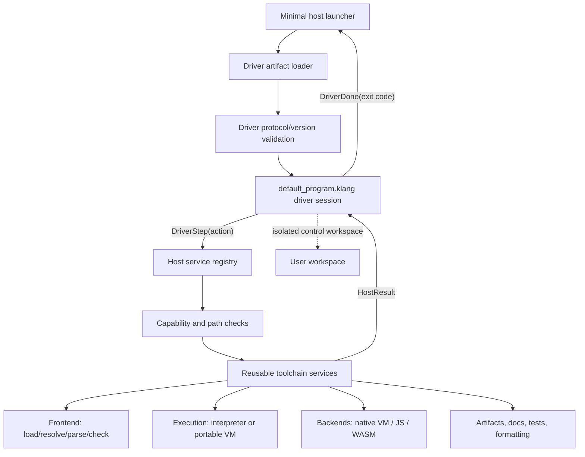

# Default Program First-Boot Gap Analysis

Status: architecture and implementation roadmap  
Review date: 2026-07-01  
Target source: `default_program.klang`  
Required specifications: `DATA-TYPES.md`, `LANGUAGE-SPEC.md`, `SYNTAX.md`  
Related plans: `JS-INTEROP-AND-PORTABLE-VM-ROADMAP.md`,
`LANGUAGE-FEATURE-PRIORITIES.md`, and `RUNTIME-SPEC.md`

## 1. Goal

The intended normal startup sequence is:

```text
native, Node, or browser launcher
  -> boot the shipped default_program.klang driver
  -> let the driver interpret the toolchain invocation
  -> request typed host/toolchain operations
  -> check, compile, run, package, or inspect the user workspace
  -> render structured results and diagnostics
  -> return a deterministic process/browser result
```

`default_program.klang` should become the language-owned control plane shared by:

- the native CLI currently implemented in root `main.go`;
- the browser/WASM bridge currently implemented in
  `cmd/klang-wasm/main.go`; and
- the Node/JavaScript launcher emitted by the JS backend.

This does not mean kLang source can literally execute before any host code. A
small trusted launcher must still load bytecode/source, allocate a VM or
interpreter, enforce capabilities, and communicate with the operating system or
browser. The design target is:

> kLang owns toolchain policy; the host kernel owns privileged mechanisms.

The default program must run as a separate trusted boot workspace before the
user workspace. It must never be merged into the user's globals, imports,
mutable state, or capabilities.

## 2. Executive Assessment

The repository is not ready to make `default_program.klang` the first normal
toolchain program yet.

Useful foundations already exist:

- a feature-rich `default_program.klang` command parser and plan generator;
- a complete native Go CLI;
- a browser/WASM bridge;
- experimental native JS generation;
- `Program`, `BuildSystem`, `WorkSpace`, `Context`, `ErrorContext`, and
  `Parsable[T]` values;
- a module resolver, checker, parser, interpreter, typed-core IR, bytecode
  compiler, and version-3 VM;
- structured diagnostic codes, spans, hints, fixes, and runtime frames;
- Atom-native error propagation;
- project manifests and a source cache; and
- explicit thread, Atomic, transaction, File, and OS rules.

The critical missing pieces are:

1. a boot artifact loader and trust policy;
2. a callable driver ABI that can return more than `Main() : Int`;
3. typed, versioned driver actions and host results;
4. a continuation/state-machine loop;
5. a reusable toolchain service extracted from root `main.go`;
6. backend capability descriptors and a host capability system;
7. a portable VM capable of running the driver;
8. a real compiler/metaprogramming query API;
9. workspace isolation and opaque handles;
10. unified diagnostics across native, JS, and WASM hosts;
11. bootstrap caching, limits, recovery, and rescue mode; and
12. cross-host conformance tests.

The safest path is incremental. First run the driver in shadow mode and compare
its decisions with the existing Go CLI. Move one command at a time only after
the results are equivalent.

## 3. Current Architecture

### 3.1 Native CLI

Root `main.go` currently owns:

- argument parsing;
- `new`, `run`, `check`, `update`, `package`, `serve`, `doc`, `fmt`, `test`,
  `file`, and legacy commands;
- project loading;
- module resolution;
- type checking and parsing;
- runtime creation;
- backend selection;
- source bundle and manifest writing;
- JS and WASM packaging;
- browser bundle generation;
- HTTP serving;
- test discovery and golden output;
- diagnostic rendering; and
- terminal presentation, including Kibi.

These operations are functions in package `main`, not a reusable service API.
Neither the WASM bridge nor a kLang driver can invoke them without duplicating
logic.

### 3.2 Browser/WASM bridge

`cmd/klang-wasm/main.go` registers:

- `klangRun`;
- `klangCheck`;
- `klangRunProject`;
- `klangCheckProject`; and
- `klangRunBytecode`.

It directly calls the checker, parser, interpreter, and bytecode VM. It does not
use the module resolver or the root CLI pipeline. Its `browserError` contains
only stage, file, line, column, and message, so it drops diagnostic codes,
labels, notes, fixes, expected/found types, and structured frames.

### 3.3 JavaScript backend

The JS backend lowers a supported kLang subset to typed-core IR and emits
`program.js`. Generated JavaScript:

- exports compiled kLang functions through `globalThis.KlangProgram`;
- directly invokes the selected kLang entrypoint under Node;
- has its own runtime helpers and error renderer; and
- does not expose the native CLI/toolchain service model.

This is a third entrypoint policy, not yet the same driver used by native and
browser hosts.

### 3.4 Bytecode VM

Bytecode version 3 currently supports a useful but limited subset:

- Null, Int, Float, Bool, String, List, function references, and iterators;
- local variables;
- arithmetic and comparisons;
- jumps and loops;
- direct function calls;
- print and assert;
- List/String indexing;
- lengths; and
- iterator pipelines.

It does not yet have the value model or host-call machinery needed by
`default_program.klang`.

### 3.5 Metaprogramming

Current metaprogramming can:

- parse source into a `Parsable[T]`;
- expose a shallow `List[Table]` statement summary;
- expose source and argument metadata;
- replace or append source text;
- poll for AST requests;
- expand keyword macro source;
- construct basic Program/BuildSystem/WorkSpace descriptors; and
- inspect runtime type metadata.

It cannot yet provide a resolved, typed, immutable semantic model of an entire
user workspace.

## 4. Concrete Problems in `default_program.klang`

The file is a useful executable design sketch, but it is not a boot driver yet.

### 4.1 It cannot currently be loaded through the normal CLI

Running:

```text
go run . check default_program.klang
```

currently fails because the file is neither listed in a `klang.project`
manifest nor marked with `load_as_script;`.

The production driver should not rely on an arbitrary current-working-directory
source file. It needs a dedicated boot loader for a shipped embedded artifact.

### 4.2 The entry ABI discards the plan

The language requires ordinary entrypoints to be `() : Int`.
`default_program.klang` defines:

```klang
function RunCLI(args : List[String]) : Table
```

but its `Main()` calls `RunCLI(Args)` twice, discards both returned Tables, and
returns zero. Nothing receives or executes the requested action.

The boot driver needs a separate ABI from the ordinary user `Main()` ABI.

### 4.3 Host actions are untyped Tables

Actions currently look like:

```klang
{
    "kind": "host_action",
    "name": "load_program",
    "payload": {"path": path}
}
```

There is no:

- protocol version;
- action identifier;
- statically checked payload type;
- capability declaration;
- result type;
- cancellation identifier;
- timeout;
- backend availability;
- retry/idempotency rule; or
- schema validation.

Misspelled fields can reach the host unnoticed.

### 4.4 No dispatcher exists

No Go package decodes and dispatches `host_action` Tables. The native CLI calls
its Go functions directly, the WASM bridge calls engine packages directly, and
generated JS invokes the user's entrypoint directly.

### 4.5 No result/resume loop exists

Many operations depend on previous results:

```text
load workspace
  -> resolve modules
  -> check types
  -> inspect diagnostics
  -> select backend
  -> compile
  -> write artifacts
  -> optionally execute
```

The runtime can run an entrypoint or test function, but does not expose a public
prepared-session API for repeatedly invoking driver functions with host results.
Coroutines do not provide a general VM suspension/continuation mechanism.

### 4.6 Plans do not match all current CLI behavior

The default program omits or simplifies behavior including:

- `fmt`/`format`;
- quiet-mode semantics;
- program cache behavior and metrics;
- exact project update/migration behavior;
- complete test and golden-output rules;
- source-aware diagnostic rendering;
- native JS artifact generation;
- WASM bytecode fallback rules;
- browser bundle generation details;
- actual server lifecycle and cancellation;
- Kibi presentation rules;
- complete legacy option parsing; and
- the current manifest fields and backend status metadata.

### 4.7 The WASM namespace simulates success

The `wasm.Check` and `wasm.Run` functions build response-shaped Tables but do not
perform real checking or execution. `wasm.RegisterBridge` returns a host action;
it cannot register JavaScript functions itself. `JsonResponse` also returns a
host action rather than serialized browser output.

### 4.8 Top-level behavior is unsuitable for a trusted driver

The file uses a top-level `run` block for assertions and registration metadata.
A boot driver should have an explicit initialization function and no hidden
top-level host effects.

### 4.9 Error values are weaker than the language error model

`ErrorPlan` carries a String in a Table. It does not use stable Atom errors or
structured `ErrorContext` values. Browser errors similarly duplicate a reduced
schema.

### 4.10 It cannot compile through the portable VM

The driver uses values and features absent from bytecode version 3, including:

- Table and Map;
- Atom;
- Option and Result;
- enums and alias structs;
- globals and richer module behavior;
- dynamic `Any`;
- selector-heavy object access;
- casts;
- exceptions;
- defer and run blocks;
- File/OS/toolchain host calls; and
- structured diagnostics.

## 5. Target Bootstrap Architecture



The launcher differs by host, but the driver protocol and driver source are the
same:

| Host | Minimal launcher responsibility |
|---|---|
| Native Go | Process args/environment, terminal, filesystem, network, native VM/interpreter, exit status |
| Node/JS | `process.argv`, Node ESM/filesystem/process adapters, JS or WASM-hosted kLang VM |
| Browser/WASM | JavaScript registration, browser storage/fetch/console adapters, WASM VM, JSON boundary |
| Deterministic tests | In-memory filesystem, fake clock/network/process, recorded actions |

## 6. Required Driver ABI

Do not change the ordinary user entrypoint contract. Add a trusted toolchain
driver ABI.

Recommended first version:

```klang
function DriverStart(
    invocation : ToolInvocation,
    host : HostDescriptor
) : DriverStep;

function DriverResume(
    state : DriverState,
    result : HostResult
) : DriverStep;
```

This explicit state machine avoids requiring resumable VM frames in the first
release. The host repeatedly calls `DriverResume` until it receives
`DriverDone`.

Suggested values:

```klang
enum DriverStepKind {
    Action,
    Done
}

alias function ToolInvocation(
    command : String,
    raw_args : List[String],
    cwd : String,
    environment : Map[String, String],
    terminal : TerminalDescriptor
) : type = struct {}

alias function HostAction(
    protocol : Int,
    id : UInt,
    operation : Atom,
    payload : JSON,
    required_capabilities : Set[Atom]
) : type = struct {}

alias function HostResult(
    protocol : Int,
    id : UInt,
    ok : Bool,
    value : JSON,
    error : Atom,
    diagnostics : List[ErrorContext]
) : type = struct {}

alias function DriverStep(
    kind : DriverStepKind,
    state : DriverState,
    action : Option[HostAction],
    exit_code : Int
) : type = struct {}
```

`DriverState` should initially be serializable immutable data, not a pointer to
runtime internals. This makes the protocol testable and portable.

Later, after the VM has explicit frames and suspension, the same public protocol
may be implemented with `yield HostAction`/`resume HostResult` without changing
host services.

## 7. Required Reusable Toolchain Service

The largest architectural prerequisite is moving orchestration out of package
`main`.

Create an importable package such as:

```text
src/toolchain
```

It should expose typed services independent of terminal rendering:

```go
type Service interface {
    LoadWorkspace(...)
    Resolve(...)
    Parse(...)
    Check(...)
    Compile(...)
    Execute(...)
    Package(...)
    Format(...)
    Test(...)
    Document(...)
    Update(...)
}
```

The root CLI, WASM bridge, test host, and HostAction dispatcher must all call the
same service. Package `main` should become only:

- host initialization;
- driver boot;
- terminal rendering;
- signal handling; and
- process exit.

Service results must contain values and diagnostics, never write directly to
`os.Stdout`, `os.Stderr`, or `os.Exit`.

### 7.1 Minimum operation registry

Initial operations should be coarse-grained:

- `tool.help`;
- `workspace.load`;
- `workspace.check`;
- `workspace.run`;
- `workspace.test`;
- `workspace.format`;
- `workspace.update`;
- `workspace.document`;
- `workspace.package`;
- `bundle.serve`;
- `artifact.read`;
- `artifact.write`; and
- `driver.done`.

Do not expose every parser/runtime function as a host action. Coarse operations
give the kernel room to preserve invariants and evolve internals.

Later query operations may include:

- `syntax.parse`;
- `semantic.symbols`;
- `semantic.type_of`;
- `semantic.references`;
- `diagnostic.explain`;
- `backend.capabilities`; and
- `workspace.apply_edits`.

## 8. Boot Artifact and Trust Model

The default driver is privileged. Loading `./default_program.klang` from the
current directory would allow an untrusted project to replace the toolchain.

Required behavior:

1. Ship the driver as an embedded source or signed/hashed bytecode artifact.
2. Record driver protocol version, language version, source hash, and required
   features.
3. Verify the artifact before execution.
4. Cache checked/compiled driver bytecode by toolchain version and hash.
5. Never search the user project for a replacement by default.
6. Allow overrides only through an explicit development option such as:

   ```text
   kLang --driver ./experimental_driver.klang ...
   ```

7. Give overrides a visible warning and an explicit capability set.
8. Keep a minimal rescue path:

   ```text
   kLang --no-driver --help
   kLang --no-driver doctor
   kLang --no-driver check-driver
   ```

9. If the driver cannot boot, render a kernel diagnostic and do not attempt to
   execute the user workspace.
10. Prevent driver actions from recursively booting another default driver
    unless explicitly requested.

Normal CLI operation can still boot the driver first. Rescue mode is necessary
so a broken driver cannot make the toolchain impossible to repair.

## 9. Workspace Isolation

The boot and user programs must have distinct:

- globals and environments;
- module-resolution state;
- Args values;
- caches and cache keys;
- permissions;
- runtime stacks;
- worker/thread trees;
- memory accounting;
- temporary directories;
- diagnostics; and
- cancellation roots.

The driver receives opaque handles or immutable snapshots:

```text
WorkspaceHandle
ProgramHandle
SyntaxTreeHandle
SemanticModelHandle
ArtifactHandle
ExecutionHandle
```

Handles need:

- host identity;
- generation/version;
- ownership;
- close/release behavior;
- use-after-close checks;
- no accidental serialization;
- no transfer to user threads unless permitted; and
- capability checks on every operation.

Do not pass Go pointers or mutable compiler structures through `Any` or Table.

## 10. Capability and Effect System

The driver is trusted to request operations, but the host still enforces policy.
User programs must not inherit driver authority.

Example capabilities:

- `workspace.read`;
- `workspace.write`;
- `fs.read`;
- `fs.write`;
- `env.read`;
- `process.spawn`;
- `process.exit`;
- `network.listen`;
- `clock.read`;
- `terminal.write`;
- `artifact.write`;
- `js.execute`;
- `browser.fetch`; and
- `browser.storage`.

Every HostAction declares required capabilities. The host checks:

1. the operation exists;
2. the driver protocol permits it;
3. the current host implements it;
4. the invocation granted it;
5. path/network/process scopes permit it; and
6. resource quotas allow it.

The action registry should also describe:

- deterministic or nondeterministic;
- pure or effectful;
- blocking or nonblocking;
- cancellable;
- idempotent;
- retry-safe;
- thread-safe; and
- available hosts.

This metadata later supports `foreign`, transactions, plugins, and backend
checking.

## 11. Portable VM Requirements

The VM should execute kLang bytecode; it should not become a JavaScript engine.
JavaScript execution remains a host capability through the interop ABI.

### 11.1 Value model

Add portable representations for:

- UInt and child-width numerics;
- Char and Atom;
- Map, Set, Table, and JSON;
- Option and Result;
- enum values;
- alias structs and type metadata;
- immutable Program/Workspace/Context descriptors;
- structured diagnostics;
- opaque host handles;
- errors/throws; and
- eventually channels, task contexts, and resources.

Every representation needs copy/equality/hash/serialization/transfer rules.

### 11.2 Execution model

Replace recursive Go VM calls with explicit frames containing:

- function index;
- instruction pointer;
- locals;
- operand-stack base;
- return target;
- source location; and
- exception/cleanup metadata.

Add:

- structured exception handling;
- defer/cleanup lowering;
- globals and modules;
- closures or an explicit first-release prohibition;
- bounded heap/allocation accounting;
- stack and instruction limits;
- cancellation checks;
- deterministic interruption; and
- full structured stack traces.

### 11.3 Host ABI

Bytecode needs versioned instructions for:

- requesting a host operation;
- yielding a DriverStep;
- accepting a HostResult;
- checking capabilities;
- creating/releasing handles; and
- emitting structured output/diagnostics.

Malformed bytecode and forged capability requests must fail before host
execution.

### 11.4 Source and feature metadata

Bytecode version 4 or later needs:

- source file table;
- line and column spans;
- feature bitmap;
- required host capabilities;
- driver protocol version;
- string/symbol pools;
- function and type tables;
- resource limits; and
- deterministic codec validation.

### 11.5 One VM, multiple hosts

Avoid three independently evolving semantic VMs.

Recommended target:

- native: the Go VM executes the same `.kbc`;
- browser: the Go VM compiled to WASM executes `.kbc`;
- Node/JS: use the WASM-hosted VM or a conformance-tested JS VM adapter;
- direct JS code generation remains an optional deployment backend, not the
  semantic authority.

## 12. Backend and Host Capability Matrix

The backend abstraction currently supports only `Name`, `Check`, `Emit`, and
`Package`. Add a read-only descriptor:

```go
type Capabilities struct {
    Values       ...
    Statements   ...
    HostServices ...
    DriverABI    int
    Bytecode     ...
}
```

The matrix must distinguish:

- compiler backend: interpreter, VM bytecode, direct JS, WASM package;
- execution host: native, Node, browser, deterministic test host; and
- permissions granted for this invocation.

Illustrative driver availability:

| Operation | Native | Node | Browser |
|---|---:|---:|---:|
| check/parse in memory | yes | yes | yes |
| run portable bytecode | yes | yes | yes |
| read project filesystem | scoped | scoped | virtual/uploaded |
| write artifacts | scoped | scoped | download/virtual |
| spawn process | scoped | scoped | no |
| listen HTTP | scoped | scoped | no |
| browser fetch | optional | optional | scoped |
| execute JS module | embedded host | native ESM | browser ESM |

Unsupported actions return `:backend_unsupported` or `:capability_denied` plus a
structured diagnostic. They must never silently succeed.

## 13. Metaprogramming Requirements

For the driver to “understand user programs,” it needs stable compiler queries,
not unrestricted access to mutable compiler memory.

### 13.1 Full immutable syntax model

Upgrade the shallow Parsable AST to include:

- stable node IDs;
- complete source spans;
- statement and expression children;
- declarations and modifiers;
- type syntax;
- patterns;
- comments/doc comments where required;
- source file identity; and
- generated-source origin chains.

### 13.2 Semantic model

Provide read-only queries for:

- resolved symbol for a reference;
- declaration and references;
- inferred and declared type;
- generic substitutions;
- trait/impl selection;
- mutability and ownership state;
- control-flow facts;
- effects and required capabilities;
- backend availability;
- module/import graph; and
- entrypoint selection.

### 13.3 Safe transformation model

Do not make raw string replacement the main rewrite API. Introduce:

- immutable edit sets;
- span conflict detection;
- format-after-edit;
- parse/check validation;
- generated-name hygiene;
- source maps from generated to original code;
- transaction-like all-or-nothing application; and
- preview diagnostics before writing.

### 13.4 Limits and determinism

Metaprogramming needs:

- instruction, allocation, recursion, and expansion limits;
- cancellation;
- no implicit clock/random/network/filesystem access;
- capability-declared host queries;
- cache keys containing source, compiler, driver, and capability versions;
- cycle detection; and
- reproducible ordering.

## 14. Diagnostic Requirements

The structured diagnostic foundation is a strong start. Remaining work:

1. Give every lexer token and AST/IR node a complete span.
2. Migrate remaining message-only producers to stable codes and typed fields.
3. Add an explicit error type to suppress cascaded checker errors.
4. Preserve related labels, fixes, notes, expected/found types, and frames
   through browser JSON.
5. Convert bytecode diagnostics to the shared diagnostic package.
6. Make direct JS errors use the same codes and source paths.
7. Add `--diagnostic-format=json`.
8. Let the driver request presentation, but keep the host as canonical renderer
   for terminal, JSON, browser, and editor output.
9. Mark whether a diagnostic originated in:
   - kernel bootstrap;
   - default driver;
   - user frontend;
   - backend;
   - host operation; or
   - user runtime.
10. Include both driver and user stack frames when an action crosses the
    boundary, without confusing the two workspaces.

The driver may explain errors or choose command-specific hints, but it must not
be able to hide kernel security or integrity failures.

## 15. Output, Events, and Presentation

Toolchain services should emit structured events:

```text
ProgressEvent
OutputEvent
DiagnosticEvent
ArtifactEvent
TestEvent
ExecutionCompleteEvent
```

The host renderer decides:

- terminal color;
- Kibi messages;
- quiet/verbose behavior;
- JSON output;
- browser DOM presentation;
- Node console output; and
- LSP/editor forwarding.

The driver selects policy such as which progress events are useful. It should
not embed ANSI escape codes or assume an interactive terminal.

## 16. Reliability and Recovery

The bootstrap path needs stronger guarantees than an ordinary program:

- catch and report host panics;
- maximum driver steps per invocation;
- instruction and allocation budgets;
- action timeouts;
- cancellation on SIGINT/browser abort;
- no action-ID reuse;
- no stale HostResult acceptance;
- deterministic cleanup of workers and handles;
- no recursive driver boot;
- driver cache invalidation by source/protocol/compiler hash;
- atomic artifact writes;
- previous-known-good driver fallback for upgrades;
- no user cache poisoning of driver artifacts; and
- a minimal `doctor` command implemented in the kernel.

If the driver fails after launching a user process or server, the kernel must
cancel and clean up that work before returning.

## 17. Testing Requirements

### 17.1 Protocol tests

- encode/decode every action and result;
- reject unknown protocol versions;
- reject unknown operations and payload fields;
- reject mismatched action IDs;
- fuzz malformed JSON/bytecode/action payloads; and
- test capability denial before side effects.

### 17.2 Shadow-mode tests

Run the existing Go CLI parser and the kLang driver against the same invocations:

- compare selected command;
- normalized options;
- program arguments;
- requested service;
- exit code;
- diagnostics; and
- artifacts.

Do not switch a command to driver ownership until its shadow result matches.

### 17.3 Cross-host conformance

For each supported action, compare:

- native host;
- Node host;
- browser/WASM host; and
- deterministic in-memory host.

Differences must be declared capabilities, not accidental behavior.

### 17.4 Isolation and security

Test:

- user source cannot import driver-private modules;
- user code cannot forge HostAction handles;
- cwd `default_program.klang` cannot replace the embedded driver;
- `--driver` override is explicit;
- user capabilities do not inherit driver capabilities;
- driver and user globals do not leak;
- path traversal is rejected;
- stale results cannot resume a new session; and
- broken driver artifacts enter rescue mode.

### 17.5 Performance

Measure:

- cold driver boot;
- cached driver boot;
- command planning latency;
- driver/host round trips;
- large workspace query latency;
- native/Node/browser VM throughput;
- peak driver and user memory separately; and
- startup with and without source-level driver recompilation.

## 18. Incremental Delivery Plan

Every item below is intended to be one focused implementation prompt.

### DP0 — Freeze existing CLI behavior

- Generate command/option fixtures from root `main.go`.
- Cover success, invalid usage, diagnostics, artifacts, and exit codes.
- Include native, JS packaging, WASM packaging/fallback, docs, tests, format,
  update, quiet, verbose, legacy flags, and Kibi.

Done when:

- the existing CLI contract can be compared mechanically with a future driver.

Suggested prompt:

> Implement DP0 from `DEFAULT-PROGRAM-FIRST-BOOT-GAP-ANALYSIS.md`. Add a
> table-driven CLI behavior suite without changing command behavior.

### DP1 — Extract `src/toolchain`

- Move load/check/run/package/test/doc/format/update orchestration out of
  package `main`.
- Return structured events and diagnostics.
- Keep root CLI output unchanged through an adapter.

Done when:

- root `main.go` contains no compiler pipeline policy beyond driver/kernel
  startup and rendering;
- WASM tests can call the same service without importing package main.

Suggested prompt:

> Implement DP1. Extract a reusable toolchain service from root main.go while
> preserving every CLI test and output contract.

### DP2 — Define protocol types and versioning

- Add typed Go protocol structs.
- Add kLang alias structs/enums for the same schema.
- Define canonical JSON encoding and validation.
- Add action IDs, protocol version, Atom errors, and diagnostics.

Done when:

- Go and kLang round-trip every protocol value in tests.

Suggested prompt:

> Implement DP2. Add versioned ToolInvocation, HostAction, HostResult,
> DriverState, and DriverStep contracts with Go/kLang codec tests.

### DP3 — Add prepared runtime sessions

- Split runtime program preparation from entrypoint invocation.
- Expose safe calls to named exported driver functions.
- Preserve global state only inside one driver session.
- Add instruction/call/step cancellation hooks.

Done when:

- Go can call DriverStart and multiple DriverResume steps without rerunning
  top-level initialization.

Suggested prompt:

> Implement DP3. Add a prepared Runtime Session API that can invoke named
> exported functions repeatedly with typed Values and structured errors.

### DP4 — Build deterministic in-memory host

- In-memory workspace/filesystem.
- Recorded actions and results.
- Fake terminal, clock, network, and process services.
- Capability enforcement.

Done when:

- driver tests require no real filesystem, process, network, or browser.

Suggested prompt:

> Implement DP4. Add an in-memory HostAction dispatcher with capability checks,
> recorded effects, cancellation, and deterministic tests.

### DP5 — Make `default_program.klang` a valid driver artifact

- Remove duplicate `RunCLI` invocation.
- Remove hidden top-level registration behavior.
- Add DriverStart/DriverResume.
- Use typed protocol values.
- Use Atom errors and ErrorContext diagnostics.
- Add `fmt` and current option parity.

Done when:

- the shipped driver checks through its dedicated loader;
- it runs fully against the in-memory host.

Suggested prompt:

> Implement DP5. Rewrite default_program.klang to the versioned driver ABI,
> preserving command policy but performing no real host effects.

### DP6 — Add embedded driver loader

- Embed trusted source or checked bytecode.
- Verify version/hash.
- Add dedicated cache and previous-known-good artifact.
- Add `--driver`, `--no-driver`, `doctor`, and `check-driver`.

Done when:

- cwd source cannot replace the driver;
- a broken driver produces a repairable bootstrap diagnostic.

Suggested prompt:

> Implement DP6. Add a verified embedded default driver loader with development
> override and rescue mode. Do not make it the default command path yet.

### DP7 — Add native HostAction dispatcher

- Dispatch coarse toolchain services.
- Validate capabilities and payloads.
- Return structured results.
- Add step, time, memory, and action limits.

Done when:

- the driver can execute help and check through the native host in opt-in mode.

Suggested prompt:

> Implement DP7. Connect the driver protocol to native help and workspace.check
> services behind `--driver-mode`, with no other command migration.

### DP8 — Shadow CLI decisions

- Run driver planning without executing its actions.
- Compare against legacy Go command parsing.
- Report mismatches only in development/test mode.

Done when:

- all command fixtures match.

Suggested prompt:

> Implement DP8. Add non-authoritative driver shadow mode and parity reports for
> every existing CLI invocation fixture.

### DP9 — Migrate help and argument parsing

- Driver owns usage text, command selection, and normalized options.
- Host still renders terminal output.
- Preserve legacy flags and program argument separation.

Done when:

- existing help/usage/invalid-command tests pass through the driver.

### DP10 — Migrate check

- Driver requests workspace.load/check.
- Service returns structured diagnostics.
- Driver chooses exit policy.

Done when:

- check behavior and cache semantics match the legacy path.

### DP11 — Migrate run

- Driver requests checked execution.
- User runtime is a separate session and capability root.
- Output and completion events cross the protocol.

Done when:

- user globals, Args, workers, and permissions cannot reach the driver.

### DP12 — Migrate format and documentation

- Use structured edits and document artifacts.
- Driver chooses command policy; service owns parser/formatter invariants.

### DP13 — Migrate tests

- Test discovery, result validation, golden output, and cancellation become
  service operations.

### DP14 — Migrate project creation and update

- Template generation and migration plans become atomic artifact operations.
- Use preview/commit so partial writes cannot corrupt projects.

### DP15 — Migrate package

- Driver requests backend capabilities and compilation.
- Service writes deterministic manifests/artifacts.
- Driver cannot write arbitrary paths without scoped capability.

### DP16 — Migrate serve

- Add cancellable server handle.
- Driver receives address/readiness events.
- Kernel owns socket and shutdown.

### DP17 — Turn driver on by default for native CLI

- Normal commands boot the embedded driver first.
- Retain `--no-driver` rescue path.
- Remove migrated policy from root main only after parity tests pass.

Done when:

- every command uses driver policy;
- no command recursively boots the driver;
- startup and failure budgets are met.

### DP18 — Unify browser diagnostics and service API

- Replace `browserError` with shared diagnostics.
- Route browser check/run through `src/toolchain`.
- Add browser capability descriptor and virtual workspace.

### DP19 — Boot driver in browser/WASM host

- Package checked driver bytecode with the browser runtime.
- Register browser host services.
- Run DriverStart/DriverResume for browser invocations.

Done when:

- `KlangBrowser` commands use the same driver policy as native.

### DP20 — Add Node host adapter

- Map terminal, filesystem, environment, process, and ESM services.
- Apply capability/path restrictions.
- Preserve protocol diagnostics and exit codes.

### DP21 — Boot driver under Node/JS

- Prefer the portable VM hosted by WASM/Node for semantic parity.
- Keep direct JS compilation as an optional optimized path.
- Add differential tests against native.

### DP22 — Portable VM version 4

- Feature/capability metadata.
- Explicit frames and structured exceptions.
- driver value model.
- host actions and suspension/state support.
- source spans and diagnostics.
- memory/resource limits.

This is a multi-prompt phase and should follow the detailed portable VM roadmap.

### DP23 — Full semantic metaprogramming queries

- Immutable full AST.
- typed semantic model;
- symbol/type/effect/backend queries;
- validated edit sets;
- source-origin chains; and
- incremental/cancellable snapshots.

### DP24 — Remove duplicated entrypoint policy

- Native root main, WASM main, and generated JS launcher become thin adapters.
- The shipped driver is the single command-policy source.
- Host-specific code remains only for capabilities, embedding, rendering,
  process/browser integration, and rescue.

## 19. Readiness Gates

Do not make the driver default until all Gate A items pass.

### Gate A — Native default boot

- [ ] Embedded verified driver artifact
- [ ] Protocol version negotiation
- [ ] Prepared runtime session
- [ ] Typed HostAction dispatcher
- [ ] Capability enforcement
- [ ] Workspace isolation
- [ ] Rescue mode
- [ ] Existing CLI parity suite
- [ ] Structured diagnostics preserved
- [ ] No recursive driver boot
- [ ] Cold/cached startup budgets
- [ ] Driver failure cleanup

### Gate B — Browser/WASM parity

- [ ] Shared toolchain service
- [ ] Shared diagnostic JSON
- [ ] Browser capability descriptor
- [ ] Virtual/uploaded workspace model
- [ ] Driver bytecode supports required values
- [ ] Browser host dispatcher
- [ ] Cross-host command fixtures
- [ ] Cancellation and resource limits

### Gate C — Node/JS parity

- [ ] Node host adapter
- [ ] ESM/JS capability integration
- [ ] Path/process permission model
- [ ] Portable VM or equivalent conformance-tested executor
- [ ] Source maps preserve driver and user frames
- [ ] Artifact and exit-code parity

### Gate D — Advanced program understanding

- [ ] Complete immutable AST
- [ ] Semantic symbol/type/effect model
- [ ] Incremental workspace snapshots
- [ ] Safe edit/transform protocol
- [ ] Macro and query limits
- [ ] Stable query diagnostics
- [ ] LSP/compiler service reuse

## 20. Non-Goals

The first-boot integration should not:

- rewrite the lexer, parser, checker, VM, or OS layer in kLang immediately;
- expose arbitrary Go functions or pointers;
- execute JavaScript by translating it into kLang bytecode;
- give user programs driver capabilities;
- load an unverified driver from the current directory;
- merge driver and user workspaces;
- allow the driver to suppress integrity/security diagnostics;
- remove the rescue kernel;
- require full self-hosting before useful migration; or
- move a command before parity tests exist.

## 21. Recommended Next Prompt

Start with DP0, not the boot switch:

> Implement DP0 from `DEFAULT-PROGRAM-FIRST-BOOT-GAP-ANALYSIS.md`. Create a
> table-driven, machine-readable fixture suite that freezes the current CLI
> commands, normalized options, diagnostics, exit codes, artifacts, quiet and
> verbose behavior, legacy flags, JS/WASM packaging behavior, and Kibi output.
> Do not change production command behavior.

After DP0, extract `src/toolchain` in DP1. Those two steps create the safety net
and reusable mechanism needed for every later driver integration prompt.
