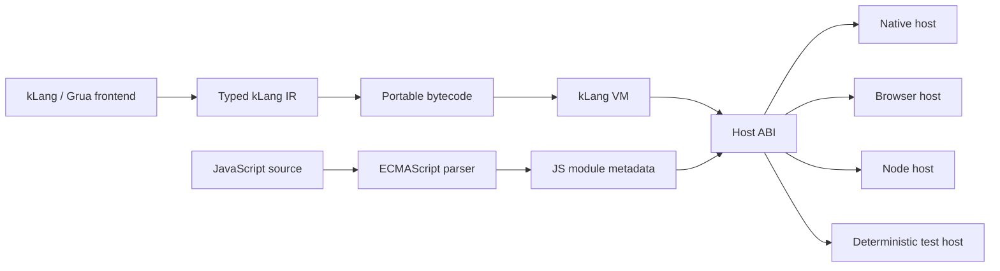

# JavaScript Interop, Portable VM, and OS Host Roadmap

Status: proposed implementation roadmap  
Scope: JavaScript source ingestion, typed JavaScript interop, portable bytecode execution, backend capability selection, and explicitly permitted OS access  
Excluded until the interop foundation is complete: Raylib bindings and the existing `stdlib/js-wasm` wrappers

## 1. Outcome

kLang should be able to:

- load JavaScript files as real ECMAScript modules;
- parse their syntax and understand imports, exports, source locations, and declared boundary types;
- report JavaScript syntax and module-resolution errors through `ErrorContext`;
- call JavaScript exports from kLang and expose selected kLang functions to JavaScript;
- run the same kLang bytecode on a native OS host and in the browser-hosted WASM runtime;
- allow OS operations only when the selected backend supports them and the user explicitly grants the required capabilities;
- preserve kLang values, Atom-only propagation, source locations, resource limits, and deterministic diagnostics across backend boundaries.

The first implementation should not attempt to compile arbitrary JavaScript into kLang bytecode. JavaScript should be parsed for understanding and validation, then executed by a JavaScript host engine through a controlled interop ABI.

## 2. Current Baseline

The repository already has useful pieces, but they are not connected into a complete interop system.

- `JSModule` and `JSCall` are builtin descriptor types.
- `js_import` reads a local `.js` file.
- `js_exports` discovers a few ESM exports with regular expressions.
- `js_call` creates a `"filesystem-only"` descriptor and does not execute JavaScript.
- `stdlib/ffi.klang` contains placeholder `JSValue`, `JSArray`, `JSObject`, and `JSPromise` Tables.
- The `JS` backend compiles a supported kLang subset into JavaScript and emits source maps.
- The `WASM` backend lowers through the shared JS IR and emits version-3 `.kbc` bytecode when the program fits the VM subset.
- The WASM bundle falls back to the full interpreter when bytecode compilation rejects a feature.
- The bytecode VM currently supports primitive values, Lists, local variables, direct kLang calls, loops, indexing, assertions, printing, and iterator pipelines.
- VM calls recursively invoke Go functions and do not yet use an explicit frame stack.
- The VM has instruction and call-depth limits, but no general heap, allocation, host-call, or capability limits.
- The backend interface supports checking, emitting, and packaging. Runtime execution and backend capabilities are not represented by that interface.
- Project manifests support name, entry, sources, and language version. They do not declare backend requirements or permissions.
- The module loader treats `.klang` and `.grua` as source languages. `.js` files are not part of the resolved mixed-language module graph.
- Native File, OS, JSON, and Parsable builtins return descriptive String errors. Implemented stdlib facades convert these to stable Atom errors.

These constraints mean the roadmap must improve the VM and host model before enabling the unfinished JS/WASM libraries.

## 3. Architectural Rules

These are the intended invariants. A later implementation prompt should not silently contradict them.

### 3.1 Parsing is not execution

Reading JavaScript means using a standards-aware ECMAScript parser and producing a source-located JS module model. Regular expressions must not be used as the authoritative parser.

Parsing answers:

- Is the source syntactically valid?
- Which modules does it import?
- Which names does it export?
- Is an export a function, class, variable, or re-export?
- Which boundary types were explicitly declared?
- Where did a diagnostic originate?

Execution is a separate host service.

### 3.2 Do not translate arbitrary JavaScript into kLang bytecode

JavaScript contains dynamic object behavior, prototypes, closures, getters, `this`, promises, generators, and host-specific globals. Reimplementing all of that in the kLang VM would create a second incomplete JavaScript engine.

The VM should execute kLang bytecode. A host adapter should execute JavaScript and exchange values through a stable ABI.

### 3.3 One portable VM, multiple hosts

The bytecode VM should depend on a narrow host interface rather than directly on Go `os`, browser globals, Node globals, or a particular JavaScript engine.



### 3.4 Capabilities must be explicit

OS access must never become an accidental side effect of selecting a backend.

Examples of separate capabilities:

- `fs.read`
- `fs.write`
- `env.read`
- `env.write`
- `process.spawn`
- `network.client`
- `clock.read`
- `random.read`
- `js.execute`
- `js.dynamic_import`

The user must request capabilities in a project manifest or CLI option. The backend and host must independently confirm that they support them.

### 3.5 Atom-only propagated failures remain universal

Interop and host failures should use stable Atoms at the kLang-facing boundary:

- `:js_parse_failed`
- `:js_module_not_found`
- `:js_export_not_found`
- `:js_type_mismatch`
- `:js_exception`
- `:js_promise_rejected`
- `:backend_unsupported`
- `:capability_denied`
- `:host_call_failed`
- `:process_start_failed`

Descriptive JavaScript messages, stacks, and host details belong in diagnostics or captured metadata. They must not replace the propagated Atom.

### 3.6 Handles require ownership rules

JavaScript objects, functions, classes, promises, and symbols cannot always be copied into ordinary kLang values. They need opaque host handles with:

- host identity;
- handle identity;
- kind metadata;
- deterministic release;
- protection against use after release;
- no accidental transfer across threads or hosts;
- explicit rules for garbage collection and finalization.

## 4. Target Backend Matrix

The roadmap proposes adding a native `VM` backend while retaining the existing meanings of `Standalone`, `JS`, and `WASM`.

| Backend | Execution engine | JavaScript execution | OS capabilities | Primary use |
|---|---|---:|---:|---|
| `Standalone` | Existing Go interpreter | Native embedded JS host, later | Yes, when granted | Compatibility and complete language behavior |
| `VM` | Native bytecode VM | Native embedded JS host | Yes, when granted | Fast portable bytecode on desktop/server OS |
| `JS` | Generated JavaScript | Native ESM/Node imports | Node capabilities when granted | npm/Node deployment |
| `WASM` | Bytecode VM in browser WASM | Browser ESM imports | No general OS access | Browser deployment |
| Future `WASI` mode | Bytecode VM in WASI | Host-dependent | Preopened WASI capabilities | Sandboxed server/CLI deployment |

`WASI` should not be treated as ordinary browser `WASM`. It should be added only after the host ABI and permission model are stable.

## 5. Proposed User Surface

The exact syntax must be approved in an architecture decision record before parser implementation. The following illustrates the intended semantics.

### 5.1 Typed JavaScript module declaration

```klang
js module math from "./math.js" {
    export function add(left : Int, right : Int) : Int;
    export function load(path : String) : Result[String, Atom];
}

function Main() : Int {
    return math.add(20, 22);
}
```

Untyped exports should initially be represented by `JSValue`, not silently by `Any`.

```klang
js module plugin from "./plugin.js" {
    export dynamic configure;
}

local JSValue result = plugin.configure.call([{"debug": True}]);
```

### 5.2 Exporting kLang functions to JavaScript

```klang
@js_export("double")
function Double(value : Int) : Int {
    return value * 2;
}
```

Only functions whose complete signature can cross the interop ABI should be exportable.

### 5.3 Project capabilities

Illustrative `klang.project` additions:

```toml
name = "js-demo"
entry = "first.klang"
language_version = 2
backend = "VM"
sources = ["first.klang", "math.js"]
capabilities = ["js.execute", "fs.read"]
```

Illustrative CLI overrides:

```text
kLang run . --backend=VM --allow=js.execute,fs.read
kLang run . --deny=process.spawn
kLang package . --backend=JS --allow=env.read
```

CLI permissions may narrow manifest permissions. They must not silently broaden them.

## 6. Value Conversion Contract

The ABI needs one canonical conversion table.

| kLang | JavaScript | Direction | Rule |
|---|---|---|---|
| `Null` | `null` | both | `undefined` is distinct and initially maps to `None()` or a JS handle |
| `Bool` | boolean | both | exact |
| `Int` | number or bigint | both | reject unsafe precision loss |
| `UInt` | number or bigint | both | reject negative input and unsafe precision loss |
| `Float` | number | both | preserve NaN/infinity policy explicitly |
| `String` | string | both | Unicode scalar semantics must be documented |
| `Char` | one-scalar string | both | reject longer strings |
| `Atom` | string or tagged value | both | use a tagged ABI representation to avoid confusing Atom and String |
| `List[T]` | Array | both | recursively convert; detect cycles |
| `Map[String,T]` | object or Map | both | representation must be declared |
| `Table` | object | both | only supported key kinds may cross; preserve key-kind identity when required |
| `Option[T]` | tagged object | both | do not conflate `None`, `null`, and `undefined` |
| `Result[T,Atom]` | tagged object | both | retain Ok/Err identity |
| `JSON` | JSON-compatible JS value | both | deterministic object order on return to kLang |
| alias struct | plain object | both | apply existing JSON field tags where requested |
| function/object/class/promise | `JSValue` handle | JS to kLang | opaque, host-owned |

Cycles, accessors, proxies, symbols, weak collections, and typed arrays should become handles in the first release rather than being recursively copied.

## 7. Delivery Phases

Each numbered work item below is intended to fit one focused implementation prompt. Do not combine work items unless the earlier item is already complete and tested.

---

## Phase 0 — Freeze the Contract

### P0.1 — Add a generated feature and backend matrix

- [ ] Create a test-owned matrix of language features against `Standalone`, `VM`, `JS`, and `WASM`.
- [ ] Record whether each feature is interpreted, compiled, host-provided, rejected, or awaiting implementation.
- [ ] Include Atom/Result, Table/Map, JSON, exceptions, globals, functions, async, threads, OS calls, and JS calls.
- [ ] Make backend diagnostics reference stable feature identifiers.

Done when:

- The matrix is generated or checked by tests.
- Adding a backend feature requires updating one authoritative capability record.

Suggested prompt:

> Implement roadmap item P0.1 from `JS-INTEROP-AND-PORTABLE-VM-ROADMAP.md`. Add a test-enforced backend feature matrix without changing runtime behavior.

### P0.2 — Write the JS interop syntax ADR

- [ ] Choose the syntax for JS module declarations.
- [ ] Choose ESM-only or ESM-plus-CommonJS for the first release.
- [ ] Define typed exports, dynamic exports, default exports, namespace imports, and re-exports.
- [ ] Define the `@js_export` surface.
- [ ] Decide whether declarations live inline, in `.d.klang` files, or both.
- [ ] Define how JSDoc may supplement but not override explicit kLang declarations.
- [ ] Add accepted/rejected syntax examples.

Done when:

- Parser work can proceed without inventing syntax during implementation.

Suggested prompt:

> Implement P0.2. Create the JS interop syntax ADR, compare the viable syntax options against the current parser, and update the required language specifications only after choosing one.

### P0.3 — Write the capability and trust ADR

- [ ] Define capability names and hierarchy.
- [ ] Define manifest syntax and CLI narrowing behavior.
- [ ] Define defaults for loose scripts and projects.
- [ ] Define path scopes for filesystem permissions.
- [ ] Define subprocess executable restrictions.
- [ ] Define browser, Node, native, and WASI differences.
- [ ] Decide whether transitive JS imports inherit or require declared capabilities.

Done when:

- Every host operation has an unambiguous permission decision.

Suggested prompt:

> Implement P0.3. Design the backend capability and trust model, including manifest fields, CLI behavior, path scoping, and denial diagnostics.

---

## Phase 1 — Backend Capability Infrastructure

### P1.1 — Add backend capability descriptors

- [ ] Extend the backend abstraction with a read-only capability descriptor.
- [ ] Represent supported value kinds, statements, host services, JS mode, and OS mode.
- [ ] Give `Standalone`, `JS`, and `WASM` explicit descriptors.
- [ ] Keep backend checking deterministic and source-located.
- [ ] Replace duplicated backend-name conditionals where the descriptor is sufficient.

Done when:

- The package command can explain why a backend accepts or rejects each requested capability.

Suggested prompt:

> Implement P1.1. Add backend capability descriptors and migrate backend checks to use them without adding the VM backend yet.

### P1.2 — Extend `klang.project`

- [ ] Add optional `backend` and `capabilities` fields.
- [ ] Preserve language-version migration behavior.
- [ ] Reject unknown capabilities with suggestions.
- [ ] Reject duplicate and contradictory declarations.
- [ ] Include capabilities in cache invalidation and workspace metadata.
- [ ] Update project creation and update commands.

Done when:

- Loading, caching, packaging, and workspace reflection agree on the requested backend and capabilities.

Suggested prompt:

> Implement P1.2. Extend project manifests with backend and capability declarations, including parsing, validation, cache keys, metadata, migration, and tests.

### P1.3 — Add CLI permission controls

- [ ] Add `--allow` and `--deny`.
- [ ] Ensure CLI flags only narrow manifest permissions by default.
- [ ] Add an explicit development-only override if broadening is desired.
- [ ] Print the effective capability set in verbose mode.
- [ ] Include effective capabilities in runtime `Context`.

Done when:

- A denied operation fails before host execution with a source-aware `:capability_denied` path.

Suggested prompt:

> Implement P1.3. Add CLI capability controls and effective-capability reporting, with tests proving that CLI settings cannot silently broaden a project.

---

## Phase 2 — VM Foundations

### P2.1 — Introduce bytecode feature flags and version 4

- [ ] Design version-4 bytecode sections.
- [ ] Add a feature bitmap and required-host-capability table.
- [ ] Add source-file and column tables instead of line-only instruction metadata.
- [ ] Keep strict bounds and allocation limits in the decoder.
- [ ] Decide whether version 3 remains readable or receives a clear migration error.
- [ ] Add malformed-input and fuzz tests.

Done when:

- A decoded program declares exactly which VM and host features it needs before execution starts.

Suggested prompt:

> Implement P2.1. Design and add bytecode version 4 with feature flags, required capabilities, richer source locations, strict decoding limits, and codec tests.

### P2.2 — Replace recursive calls with explicit frames

- [ ] Add a VM frame stack containing function, instruction pointer, locals, operand base, and return target.
- [ ] Execute calls in one dispatch loop.
- [ ] Preserve call-depth limits and stack traces.
- [ ] Add tail-call reuse where the compiler marks a safe self-tail-call.
- [ ] Test deep non-recursive and recursive programs.

Done when:

- VM call depth is controlled by VM configuration rather than the Go call stack.

Suggested prompt:

> Implement P2.2. Refactor the bytecode VM to an explicit frame stack while preserving behavior, diagnostics, limits, and tests.

### P2.3 — Add VM heap values and handle ownership

- [ ] Separate immediate values from heap-managed Lists, Maps, Tables, strings, objects, and host handles.
- [ ] Define immutable snapshots and copy-on-write behavior matching the interpreter.
- [ ] Add deterministic handle release.
- [ ] Add cycle-safe traversal.
- [ ] Add heap byte/object limits.
- [ ] Prevent handles from being serialized into `.kbc`.

Done when:

- Aggregate operations no longer depend on recursively copying every VM value.

Suggested prompt:

> Implement P2.3. Introduce the VM heap and owned handle model, beginning with behavior-preserving List and String storage plus resource limits.

### P2.4 — Add structured VM traps

- [ ] Replace free-form VM errors with trap codes and source locations.
- [ ] Include function frames and host-call context.
- [ ] Distinguish programmer traps, capability denials, resource limits, and host failures.
- [ ] Map traps consistently into `ErrorContext`.

Done when:

- Native and WASM VM failures produce the same stable rule, location, and stack shape.

Suggested prompt:

> Implement P2.4. Add structured VM traps and ErrorContext conversion without changing the supported opcode set.

---

## Phase 3 — VM Language Parity Required by Interop

### P3.1 — Add Atom, Option, and Result values

- [ ] Add VM kinds and constructors.
- [ ] Add equality and display semantics.
- [ ] Add `.some`, `.ok`, and guarded `.value`.
- [ ] Add bytecode construction and pattern operations.
- [ ] Add Atom-only `!` propagation.
- [ ] Test parity with the interpreter.

Done when:

- A bytecode program can return and propagate `Result[T,Atom]`.

Suggested prompt:

> Implement P3.1. Add Atom, Option, and Result support to IR lowering, bytecode, codec, and VM with interpreter-parity tests.

### P3.2 — Add throw, catch, and unwinding

- [ ] Add exception-region metadata or handler opcodes.
- [ ] Unwind explicit VM frames to the nearest handler.
- [ ] Bind only Atom values in catch blocks.
- [ ] Run deferred cleanup during unwinding once defer is supported.
- [ ] Produce an uncaught-Atom trap at the entry boundary.

Done when:

- `throw :code`, `catch`, and `Result[T,Atom]!` behave identically in the interpreter and VM.

Suggested prompt:

> Implement P3.2. Add Atom-only exception handling and frame unwinding to the bytecode compiler and VM.

### P3.3 — Add Map, Table, JSON, and selectors

- [ ] Add Map and Table heap representations.
- [ ] Preserve Table key-kind identity and insertion order.
- [ ] Add indexed read/write and fallback behavior.
- [ ] Add field selectors and builtin protocol selectors.
- [ ] Add JSON as an immutable VM value or a canonical tagged host-independent representation.
- [ ] Add conversion and bounds/type traps.

Done when:

- The interop conversion table has VM representations for all copyable boundary values.

Suggested prompt:

> Implement P3.3. Add Map and Table to the VM first, including insertion order, key identity, indexing, mutation isolation, selectors, codec support, and parity tests.

### P3.4 — Add globals, closures, and indirect calls

- [ ] Add immutable and mutable globals.
- [ ] Add closure environments and captured values.
- [ ] Add indirect function calls.
- [ ] Enforce existing thread-transfer rules for captured state.
- [ ] Add function and closure lifetime tests.

Done when:

- kLang callbacks can cross the JS boundary through a controlled callable handle.

Suggested prompt:

> Implement P3.4. Add VM globals and indirect calls first; keep closures as a follow-up sub-step if the patch becomes too large.

### P3.5 — Add a builtin/host-call instruction

- [ ] Add a stable builtin identifier table.
- [ ] Separate pure VM builtins from host calls.
- [ ] Encode argument and return arity.
- [ ] Validate required capabilities before dispatch.
- [ ] Return structured Result/Atom failures.
- [ ] Never dispatch by an unchecked arbitrary string.

Done when:

- The VM can invoke a deterministic test host without importing Go runtime packages.

Suggested prompt:

> Implement P3.5. Add versioned builtin and host-call dispatch to bytecode and the VM using a deterministic fake host.

---

## Phase 4 — Portable Host ABI and OS Services

### P4.1 — Define the Host interface

- [ ] Define host identity and supported capabilities.
- [ ] Define calls, arguments, results, traps, cancellation, and source context.
- [ ] Define handle creation, lookup, and release.
- [ ] Define synchronous behavior first.
- [ ] Add a no-capability host and deterministic test host.

Done when:

- VM tests can run without a real OS and can assert exact host interactions.

Suggested prompt:

> Implement P4.1. Add the portable Host interface, no-op host, and deterministic test host without connecting real OS operations.

### P4.2 — Implement filesystem capabilities

- [ ] Add read, metadata, write, create, append, and remove host calls.
- [ ] Canonicalize paths before permission checks.
- [ ] Prevent `..` and symlink escapes from permitted roots.
- [ ] Distinguish read and write grants.
- [ ] Apply byte and file-count limits.
- [ ] Map failures to operation-specific Atoms.

Done when:

- Native VM file behavior matches the stdlib facade and denial tests cover traversal and symlink escapes.

Suggested prompt:

> Implement P4.2. Add capability-scoped filesystem Host operations with path containment, limits, Atom errors, and security tests.

### P4.3 — Implement environment, clock, random, and process services

- [ ] Add environment reads and writes as separate capabilities.
- [ ] Add clock and random providers that can be replaced in tests.
- [ ] Add subprocess execution behind `process.spawn`.
- [ ] Execute directly without an implicit shell.
- [ ] Allow executable and working-directory restrictions.
- [ ] Bound output, duration, and child count.
- [ ] Add cancellation.

Done when:

- Native VM programs can use OS services only through the Host and only when granted.

Suggested prompt:

> Implement P4.3. Add environment and clock services first; implement subprocess execution in a separate follow-up if needed.

### P4.4 — Route interpreter OS builtins through Host

- [ ] Give the existing interpreter the same Host interface.
- [ ] Route File and OS builtins through it.
- [ ] Preserve current stdlib Atom codes.
- [ ] Keep a compatibility host for existing unrestricted behavior only where policy permits.
- [ ] Add interpreter/VM parity tests using the same fake host.

Done when:

- OS semantics no longer diverge between the interpreter and VM.

Suggested prompt:

> Implement P4.4. Route interpreter File and OS builtins through the portable Host interface with parity tests.

---

## Phase 5 — Native VM Backend

### P5.1 — Add the `VM` backend contract

- [ ] Add `VM` to BuildSystem validation, CLI parsing, context phases, manifests, and documentation.
- [ ] Compile to `.kbc`.
- [ ] Package source maps and capability metadata beside bytecode.
- [ ] Do not silently fall back to the interpreter for an explicitly selected `VM` backend.

Done when:

- `kLang package . --backend=VM` produces a validated native bytecode package.

Suggested prompt:

> Implement P5.1. Add the explicit VM backend across CLI, BuildSystem, Context, packaging, and tests, reusing the bytecode compiler.

### P5.2 — Add native VM execution

- [ ] Add `kLang run . --backend=VM`.
- [ ] Construct the effective native Host from manifest and CLI capabilities.
- [ ] Decode and verify bytecode before execution.
- [ ] Preserve program arguments, output, exit status, and ErrorContext.
- [ ] Report unsupported compiler features rather than falling back.

Done when:

- A pure kLang program and a permitted filesystem program run under the native VM.

Suggested prompt:

> Implement P5.2. Add native VM execution with arguments, host construction, capability checks, output, exit status, and diagnostics.

### P5.3 — Build interpreter/VM conformance fixtures

- [ ] Run shared fixtures on both engines.
- [ ] Compare values, output, Atom failures, and diagnostics.
- [ ] Cover primitives, collections, functions, exceptions, JSON, file access, and denied access.
- [ ] Add instruction and heap-limit fixtures.

Done when:

- VM parity is measured automatically rather than inferred from unit tests.

Suggested prompt:

> Implement P5.3. Create a shared interpreter-versus-VM conformance harness and migrate representative fixtures into it.

---

## Phase 6 — JavaScript Frontend

### P6.1 — Select and isolate an ECMAScript parser

- [ ] Evaluate maintained parser options through an ADR.
- [ ] Require ESM, modern syntax, comments, source ranges, and recoverable diagnostics.
- [ ] Hide the dependency behind `src/engine/jsfrontend`.
- [ ] Do not expose dependency AST types outside that package.
- [ ] Pin the dependency and add license metadata.

Done when:

- A parser can be replaced without changing the module system or Host ABI.

Suggested prompt:

> Implement P6.1. Write the parser selection ADR, then add the isolated jsfrontend package and syntax-diagnostic tests for the chosen parser.

### P6.2 — Define the internal JS module model

- [ ] Represent static imports, dynamic imports, local exports, default exports, and re-exports.
- [ ] Represent export kind and source span.
- [ ] Preserve comments/JSDoc needed for boundary declarations.
- [ ] Record unsupported or host-sensitive constructs.
- [ ] Replace regex export discovery.

Done when:

- `js_exports` is parser-backed and invalid JavaScript returns `:js_parse_failed`.

Suggested prompt:

> Implement P6.2. Add the internal JS module model and replace regex-based js_exports with parser-backed discovery.

### P6.3 — Add `.js` to mixed-language project loading

- [ ] Add JavaScript as a SourceFile language.
- [ ] Permit `.js` in project source lists.
- [ ] Keep `.js` invalid as the kLang entry point unless explicitly supported later.
- [ ] Cache parsed JS modules by content hash and parser version.
- [ ] Include JS diagnostics in `Context`.

Done when:

- A project can list kLang and JavaScript sources and receive unified diagnostics.

Suggested prompt:

> Implement P6.3. Extend file loading and project manifests for non-entry `.js` sources, including language tagging, caching, and diagnostics.

### P6.4 — Resolve the ESM module graph

- [ ] Resolve relative file imports first.
- [ ] Canonicalize paths and detect cycles.
- [ ] Validate imported and re-exported names.
- [ ] Defer package/bare-specifier resolution to a later item.
- [ ] Reject network imports initially.
- [ ] Attach import-chain context to errors.

Done when:

- Static ESM graphs are deterministic and source-located.

Suggested prompt:

> Implement P6.4. Add local-file ESM graph resolution with cycles, re-exports, cache integration, and import-chain diagnostics.

---

## Phase 7 — Typed JavaScript Boundary

### P7.1 — Parse JS module declarations in kLang

- [ ] Implement the approved P0.2 syntax.
- [ ] Add AST nodes and formatter support.
- [ ] Bind declarations to resolved JS module exports.
- [ ] Diagnose missing, duplicate, and kind-mismatched exports.
- [ ] Keep dynamic exports explicit.

Done when:

- The checker knows the kLang signature of each declared JS export without executing JS.

Suggested prompt:

> Implement P7.1 using the approved JS syntax ADR. Add lexer/parser/AST/formatter support and export-name validation, but no execution.

### P7.2 — Add builtin `JSValue` and `JSHandle`

- [ ] Replace placeholder Table modeling for opaque JS values.
- [ ] Add runtime and checker types.
- [ ] Make handles non-copyable or identity-copyable according to the ownership ADR.
- [ ] Mark handles non-transferable across spawn.
- [ ] Add `.kind`, `.released`, and explicit `release`.
- [ ] Reject serialization and bytecode constants containing handles.

Done when:

- Dynamic JS values have a safe representation that cannot masquerade as ordinary Table data.

Suggested prompt:

> Implement P7.2. Add opaque JSValue/JSHandle types with ownership, release, thread-transfer, serialization, and diagnostic rules.

### P7.3 — Implement copy-value marshaling

- [ ] Implement the conversion table for primitive and recursively copyable values.
- [ ] Preserve Atom/String and Option/null/undefined distinctions.
- [ ] Detect cycles and depth/size limits.
- [ ] Validate Int/UInt precision.
- [ ] Convert failures to `:js_type_mismatch`.
- [ ] Add property-based round-trip tests.

Done when:

- Supported values round-trip between kLang and a fake JS host without type loss.

Suggested prompt:

> Implement P7.3. Add host-independent kLang/JS ABI marshaling for primitive, List, Map/Table, Option, Result, Atom, JSON, and alias-struct values.

### P7.4 — Type-check JS calls and kLang exports

- [ ] Check argument and return types against declarations.
- [ ] Restrict exported kLang signatures to ABI-safe values.
- [ ] Require `JSValue` for dynamic boundaries.
- [ ] Include expected/found type trees in diagnostics.
- [ ] Add `@js_export` validation.

Done when:

- Invalid interop programs fail before loading a JS engine.

Suggested prompt:

> Implement P7.4. Add checker rules for typed JS imports and @js_export functions, including ABI-safety diagnostics.

---

## Phase 8 — JavaScript Execution Host

### P8.1 — Define the JS engine adapter

- [ ] Define compile/load, instantiate, get export, call, construct, property access, and release operations.
- [ ] Define realm/module identity.
- [ ] Define exception and stack capture.
- [ ] Define cancellation and execution limits.
- [ ] Add a fake adapter for deterministic tests.

Done when:

- Interop tests can exercise the complete call protocol without a real engine.

Suggested prompt:

> Implement P8.1. Add the JS engine adapter interface and fake implementation integrated with the Host handle table.

### P8.2 — Add a native embedded JavaScript engine

- [ ] Select the engine through an ADR.
- [ ] Start with ESM modules and synchronous calls.
- [ ] Disable unrestricted host globals and dynamic code generation by default.
- [ ] Enforce instruction/time/memory limits where the engine permits.
- [ ] Route permitted OS services through the kLang Host, not engine-native escape hatches.
- [ ] Capture JS stack frames and source locations.

Done when:

- `Standalone` and native `VM` can call a local synchronous ESM export.

Suggested prompt:

> Implement P8.2. Integrate the selected embedded JS engine for local synchronous ESM calls behind js.execute and the Host ABI.

### P8.3 — Execute JS calls from the interpreter

- [ ] Upgrade `js_import` to return `Result[JSModule,Atom]` through the stdlib facade.
- [ ] Make `js_call` execute rather than return a descriptor, or add a new execution API while deprecating the descriptor behavior.
- [ ] Bind typed declarations to engine exports.
- [ ] Marshal arguments/results.
- [ ] Convert thrown JS exceptions to `:js_exception` plus captured diagnostic metadata.

Done when:

- A kLang interpreter fixture imports `add.js`, calls `add(20,22)`, and receives `42`.

Suggested prompt:

> Implement P8.3. Connect interpreter JS imports and calls to the engine adapter with Atom errors and source-aware JS stacks.

### P8.4 — Execute JS calls from bytecode

- [ ] Lower typed JS calls to host-call bytecode.
- [ ] Carry module/export identifiers in verified metadata tables.
- [ ] Reject undeclared dynamic calls unless they use `JSValue`.
- [ ] Reuse the same marshaling and handle tables as the interpreter.

Done when:

- The same synchronous JS-call fixture passes on `Standalone` and native `VM`.

Suggested prompt:

> Implement P8.4. Lower typed JS imports/calls to VM host calls and add interpreter/VM parity fixtures.

---

## Phase 9 — Backend-Specific JavaScript Integration

### P9.1 — Emit native ESM imports in the JS backend

- [ ] Preserve JS source modules in the package.
- [ ] Emit static ESM imports for typed declarations.
- [ ] Emit marshaling only where kLang representation differs.
- [ ] Preserve source maps across kLang-generated and user-authored JS.
- [ ] Generate a Node-compatible package manifest when OS capabilities are requested.

Done when:

- The JS backend executes the same JS fixture without an embedded engine.

Suggested prompt:

> Implement P9.1. Teach the JS backend to package user JS modules and emit typed static ESM imports with source-map tests.

### P9.2 — Add the Node host shim

- [ ] Implement allowed filesystem, environment, clock, random, and process capabilities.
- [ ] Deny undeclared capabilities before touching Node APIs.
- [ ] Match native Host Atom errors and result shapes.
- [ ] Avoid exposing unrestricted `process`, `require`, or filesystem objects to imported modules unless policy explicitly allows them.

Done when:

- Native VM and Node JS backend pass the same OS capability fixtures.

Suggested prompt:

> Implement P9.2. Add a capability-enforcing Node host shim and conformance tests against the native Host.

### P9.3 — Add the browser/WASM JS host

- [ ] Use browser ESM loading.
- [ ] Expose no general OS capabilities.
- [ ] Support browser-safe capabilities such as clock and cryptographic random where approved.
- [ ] Bridge VM host calls through the WASM/JS boundary.
- [ ] Ensure handles cannot outlive the WASM instance.

Done when:

- The WASM bytecode VM calls a browser JS module and cleanly rejects filesystem or process requests.

Suggested prompt:

> Implement P9.3. Add browser ESM execution and the WASM-to-JS Host bridge with capability-denial tests.

### P9.4 — Add package/bare-specifier resolution

- [ ] Define lockfile behavior.
- [ ] Resolve package exports deterministically.
- [ ] Avoid implicit network access during run.
- [ ] Add an explicit dependency-fetch command if desired.
- [ ] Cache by content and integrity hash.
- [ ] Define Node and browser package differences.

Done when:

- Reproducible builds do not depend on ambient `node_modules` unless explicitly configured.

Suggested prompt:

> Implement P9.4. Design and add deterministic bare-specifier/package resolution with lockfile and integrity behavior.

---

## Phase 10 — Async, Callbacks, and Promises

### P10.1 — Add VM suspension

- [ ] Represent suspended frames and resumable execution.
- [ ] Define cancellation.
- [ ] Preserve instruction and heap budgets across resumes.
- [ ] Prevent resume after completion.
- [ ] Keep host handles alive only while required.

Done when:

- A deterministic fake host can suspend and resume one VM call.

Suggested prompt:

> Implement P10.1. Add resumable VM execution for one suspended Host call with cancellation and budget preservation.

### P10.2 — Bridge JavaScript Promise to Awaitable

- [ ] Add `JSPromise[T]` or map declared promises to `Awaitable[T]`.
- [ ] Convert fulfillment values through the ABI.
- [ ] Convert rejection to `:js_promise_rejected`.
- [ ] Preserve JS rejection stack metadata.
- [ ] Handle cancellation and dropped promises.

Done when:

- `await` works for a declared Promise export on native and browser hosts.

Suggested prompt:

> Implement P10.2. Bridge declared JavaScript Promise returns into kLang Awaitable with Atom rejection semantics.

### P10.3 — Bridge callbacks

- [ ] Export ABI-safe kLang functions as host callable handles.
- [ ] Define reentrancy.
- [ ] Define callback thread affinity.
- [ ] Reject callbacks after release.
- [ ] Prevent callbacks from bypassing capability checks.
- [ ] Add nested JS-to-kLang-to-JS tests.

Done when:

- A JS function can synchronously call a kLang callback under interpreter and VM execution.

Suggested prompt:

> Implement P10.3. Add synchronous JS-to-kLang callback handles with reentrancy, lifetime, and capability rules.

### P10.4 — Add async event-loop policy

- [ ] Define who owns the event loop for each backend.
- [ ] Define program exit while tasks remain.
- [ ] Define timer and I/O task cancellation.
- [ ] Define interaction with `spawn`, which remains a separate thread boundary.
- [ ] Add deterministic scheduler tests.

Done when:

- Async behavior is backend-consistent and does not depend on accidental engine scheduling.

Suggested prompt:

> Implement P10.4. Specify and implement the cross-backend event-loop lifecycle and deterministic scheduler tests.

---

## Phase 11 — Enable Deferred Standard Libraries

### P11.1 — Replace placeholder `ffi.klang` Tables

- [ ] Use builtin JSValue/handle types.
- [ ] Return `Result[...,Atom]`.
- [ ] Remove filesystem-only status behavior.
- [ ] Add typed helper APIs that mirror the approved interop syntax.
- [ ] Deprecate compatibility descriptor functions with migration hints.

Done when:

- `ffi.klang` is a thin typed facade over implemented runtime behavior.

Suggested prompt:

> Implement P11.1. Rewrite ffi.klang over the completed JSValue and Host APIs, preserving compatible names where sensible.

### P11.2 — Enable `stdlib/js-wasm`

- [ ] Audit each wrapper against real browser APIs.
- [ ] Replace guessed Tables with typed JS declarations.
- [ ] Add capability requirements.
- [ ] Add browser fixtures.
- [ ] Enable modules incrementally rather than all at once.

Done when:

- Each enabled wrapper has an executable browser test and no placeholder behavior.

Suggested prompt:

> Implement P11.2 for one js-wasm module only. Convert it to typed declarations and add a browser integration fixture before moving to the next module.

### P11.3 — Design Raylib FFI separately

- [ ] Decide native ABI mechanism.
- [ ] Define library loading and symbol declarations.
- [ ] Define pointers, buffers, structs, callbacks, and ownership.
- [ ] Apply capability and library-path policy.
- [ ] Keep native FFI distinct from JavaScript interop while sharing the Host and handle foundations.

Done when:

- Raylib can be implemented without special-casing the VM or weakening JS security.

Suggested prompt:

> Implement P11.3 as an ADR only. Design native FFI and Raylib requirements on top of the Host/handle model without adding bindings yet.

---

## Phase 12 — Hardening and Release

### P12.1 — Security test suite

- [ ] Filesystem traversal and symlink escape tests.
- [ ] Capability escalation tests.
- [ ] Malicious bytecode and malformed JS tests.
- [ ] Infinite-loop and allocation-limit tests.
- [ ] Handle use-after-release tests.
- [ ] Prototype pollution and cyclic-object marshaling tests.
- [ ] Subprocess argument and shell-injection tests.

Done when:

- Security-sensitive regressions fail in CI with stable rule identifiers.

Suggested prompt:

> Implement P12.1. Add the interop/host security regression suite and document the threat model covered by each fixture.

### P12.2 — Fuzz and differential tests

- [ ] Fuzz bytecode decode/verify.
- [ ] Fuzz ABI value conversion.
- [ ] Fuzz JS module graph resolution.
- [ ] Differentially compare interpreter and VM behavior.
- [ ] Differentially compare native, Node, and browser host result envelopes.

Done when:

- Fuzz targets run in ordinary Go test mode with bounded seeds and in extended CI mode.

Suggested prompt:

> Implement P12.2. Add the first bounded fuzz targets for bytecode verification and ABI round-trip conversion.

### P12.3 — Performance baselines

- [ ] Record VM dispatch, calls, collections, host calls, JS calls, and startup benchmarks.
- [ ] Measure native VM versus interpreter.
- [ ] Measure marshaling by value size and nesting.
- [ ] Track heap and handle counts.
- [ ] Set regression thresholds only after stable baselines exist.

Done when:

- Optimization work can be justified by measured bottlenecks.

Suggested prompt:

> Implement P12.3. Add reproducible performance benchmarks for VM execution, Host calls, and ABI marshaling without optimizing yet.

### P12.4 — Remove fallback ambiguity

- [ ] Make backend fallback an explicit user policy.
- [ ] Never silently switch an explicitly requested `VM` program to the interpreter.
- [ ] Report unsupported features before packaging.
- [ ] Include backend mode and effective capabilities in package manifests.
- [ ] Document compatibility guarantees.

Done when:

- Users can tell exactly which engine executed their program.

Suggested prompt:

> Implement P12.4. Make backend fallback explicit, expose execution-engine metadata, and add CLI/package diagnostics.

## 8. Milestones

### Milestone A — Portable VM foundation

Requires:

- P0.1 through P0.3
- P1.1 through P1.3
- P2.1 through P2.4
- P3.1, P3.2, P3.5
- P4.1

Proof:

- A VM program uses Atom Result propagation and a deterministic fake host.

### Milestone B — Native OS VM

Requires:

- Milestone A
- P3.3
- P4.2 through P4.4
- P5.1 through P5.3

Proof:

- `kLang run . --backend=VM --allow=fs.read` reads an allowed file.
- The same program fails with `:capability_denied` without permission.

### Milestone C — Synchronous JavaScript interop

Requires:

- Milestone B
- P6.1 through P6.4
- P7.1 through P7.4
- P8.1 through P8.4

Proof:

- Interpreter and native VM import a local ESM file and call a typed synchronous export.

### Milestone D — Cross-backend JavaScript

Requires:

- Milestone C
- P9.1 through P9.3

Proof:

- The same typed JS fixture runs under `Standalone`, `VM`, `JS`, and browser `WASM`.
- OS capability fixtures pass on native/Node and are predictably denied in browser WASM.

### Milestone E — Async and production hardening

Requires:

- P10.1 through P10.4
- P12.1 through P12.4

Proof:

- Promise and callback fixtures pass across supported hosts.
- Resource, capability, malformed-input, and ownership tests are enforced in CI.

## 9. Definition of Done for the Whole Roadmap

- [ ] JavaScript exports are discovered by a real parser, not regex.
- [ ] Mixed `.klang`/`.js` projects receive unified source diagnostics.
- [ ] Typed JS calls fail statically when declarations do not match.
- [ ] Dynamic values use opaque JS handles with explicit lifetime rules.
- [ ] The VM supports the values and control flow required by the interop ABI.
- [ ] Native VM execution is a first-class backend.
- [ ] Interpreter and VM use the same Host contract.
- [ ] OS access requires explicit, scoped capabilities.
- [ ] Native, Node, and browser hosts have conformance tests.
- [ ] Browser WASM denies unsupported OS operations predictably.
- [ ] Atom-only error propagation remains intact across JS and host boundaries.
- [ ] JS exceptions and stacks appear as diagnostic metadata without becoming mutable thrown values.
- [ ] Bytecode and JS execution have instruction/time, memory, depth, and handle limits.
- [ ] Raylib and `js-wasm` are enabled only after their real interop layers exist.
- [ ] Required specifications and user-facing syntax documentation match the implementation at every completed milestone.

## 10. Recommended Next Prompt

Start with P0.1. It is intentionally read-only with respect to runtime semantics and gives every later prompt a testable definition of backend support.

```text
Implement roadmap item P0.1 from JS-INTEROP-AND-PORTABLE-VM-ROADMAP.md.
Add a test-enforced feature/capability matrix for Standalone, JS, and WASM,
plus the planned VM backend. Derive the current statuses from the actual
interpreter, JS lowerer, bytecode compiler, and backend implementations.
Do not add new runtime features yet.
```
